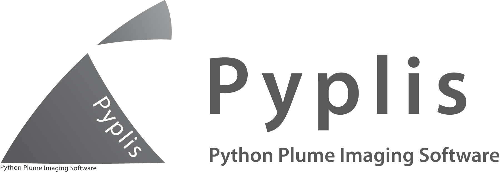
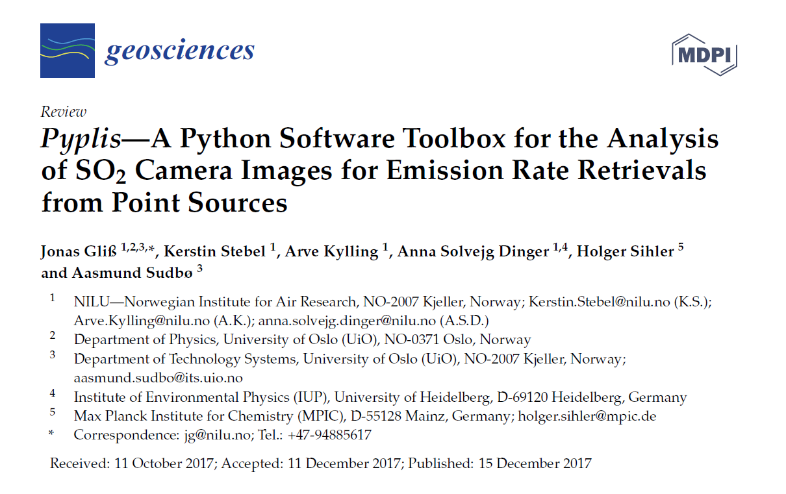

.. pyplis documentation master file, created by
   sphinx-quickstart on Fri Aug 12 12:15:41 2016.
   You can adapt this file completely to your liking, but it should at least
   contain the root `toctree` directive.

######################################
Pyplis - Python Plume Imaging Software
######################################

Official website of pyplis, a Python software containing algorithms and analysis routines for UV SO2 camera data. Apart from the API documentation, this website includes additional relevant information about the software (e.g. installation details, access of example data) as well as useful practical information that helps getting started with pyplis.

A paper introducing the software is published in the Journal *Geosciences* (MDPI). If you find pyplis useful for your analysis, we highly appreciate if you acknowledge our work by citing the `paper <http://www.mdpi.com/2076-3263/7/4/134>`__.

    Screenshot of the pyplis `paper <http://www.mdpi.com/2076-3263/7/4/134>`__. Please acknowledge our work by citing the paper.
    
**Contents:**

.. toctree::
   :maxdepth: 3

   intro
   examples
   gallery
   further_reading
   api
   contributing
   supplemental
   changelog

Indices and tables
==================

* :ref:`genindex`
* :ref:`modindex`
* :ref:`search`