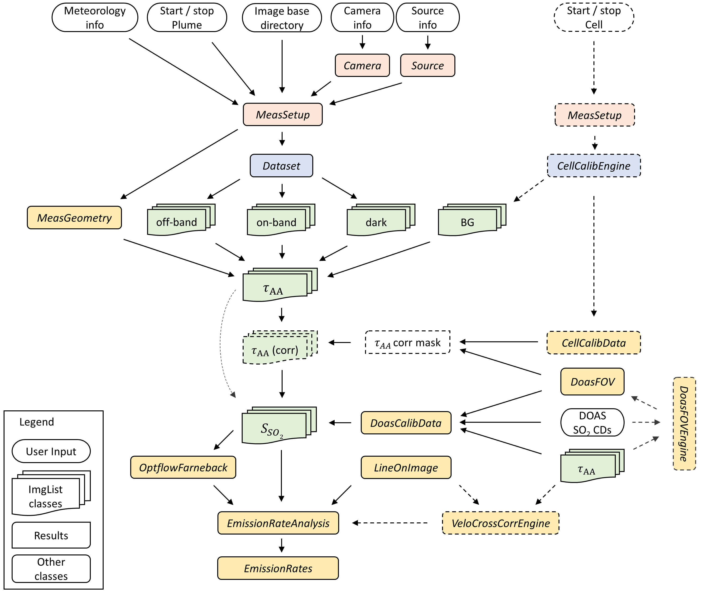
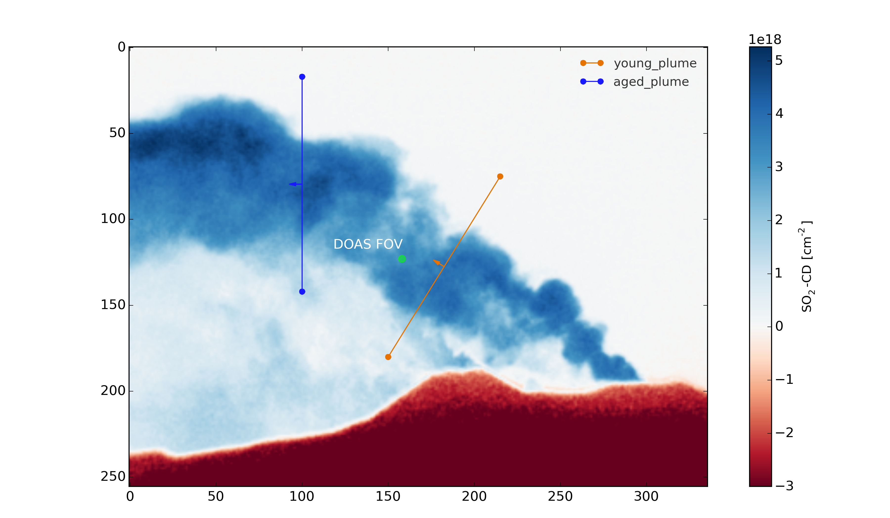

.. _installation:

Installation
============

pip
---------

The easiest way to install pyplis is using pip. You can do this by running the following command in your terminal::

  pip install pyplis

conda
-------------------------

If you use conda as package manager, you can also install pyplis using conda-forge::

  conda install -c conda-forge pyplis

This will install pyplis and all it's dependencies into the current conda environment.
If you are unfamiliar with conda, please see `here <https://docs.conda.io/projects/conda/en/stable/user-guide/getting-started.html>`__.

From source
-----------

You may also install from source by cloning the `Pyplis GitHub repository <https://github.com/jgliss/pyplis>`_
and running::

  pip install .

from the command line in the project's root directory. Note that this will not install any dependencies. If you use
conda, you may install the dependencies using the provided `pyplis_env.yml` file via::

  conda env update --file pyplis_env.yml

Optional dependencies (to use extra features)
---------------------------------------------

- Pillow (PIL fork) >= 3.3.0
  - may be used to define custom image read functions, see e.g. `this example <https://pyplis.readthedocs.io/en/latest/api.html#pyplis.custom_image_import.load_hd_new>`_

Installation remarks and known issues
-------------------------------------

- If you work on a Windows machine and run into problems with installation of one of the requirements check out the pre-compiled binary wheels on Christoph Gohlke's `webpage <http://www.lfd.uci.edu/~gohlke/pythonlibs/>`_
- Sometimes it is helpful, to reinstall your whole Python environment (or, if you use Anaconda, `create a new one <https://conda.io/docs/user-guide/tasks/manage-environments.html>`_) rather than trying to upgrade all dependencies to the required version
- If you find a bug or detect a specific problem with one of the requirements (e.g. due to future releases) please let us know or `raise an issue <https://github.com/jgliss/pyplis/issues>`_.

Do not hesitate to contact us (or raise an issue `here <https://github.com/jgliss/pyplis/issues>`__), if you have problems installing pyplis.

Main features
=============

- **Measurement Geometry**: Detailed analysis and representation of the measurement geometry including automatic retrieval of distances to the emission plume and/or to topographic features in the camera images (at pixel-level).
- **Plume background**: Several routines for the retrieval of plume background intensities (either from plume images directly or using an additional sky reference image).
- **Camera calibration**: Several routines for SO2 calibration from optical densities:
  
   - **Cell calibration**: Cell calibration engine to perform automatic camera calibration based on SO2 cells.
   - **DOAS calibration**: DOAS calibration engine including two methods to identify the field of view of a DOAS instrument within the camera images.
   - **Cross-detector SO2 sensitivity correction**: Correction arising from wavelength shifts in the filter transmission windows.

- **Plume velocities**: Several methods to retrieve plume velocities needed for emission rate retrieval:
  
   - **Optical flow**: Velocity retrieval using optical flow methods.
   - **Signal cross correlation**: Velocity retrieval using signal cross-correlation.
   - **Optical flow histogram**: Post-analysis of optical flow field for gas velocity analysis in low contrast image regions, where the optical flow fails to detect motion (cf. `Gliss et al., 2018, AMT <https://www.atmos-meas-tech.net/11/781/2018/>`_).

- **Signal scattering dilution**: Routine for image-based correction of the signal dilution effect based on contrast variations of dark terrain features located at different distances in the images.
- **Emission rate retrieval**: High-level engine to retrieve SO2 emission rates for a batch of images.
- **Various image formats**: Support of standard image formats including `FITS format <https://de.wikipedia.org/wiki/Flexible_Image_Transport_System>`_.
- **Modular design and high flexibility**: Easy to integrate with custom code.

A detailed description of pyplis and its features (including analysis examples) can be found in `Gliss et al., 2017, MDPI Geosciences <http://www.mdpi.com/2076-3263/7/4/134>`__.

Architecture
============

The following two flowcharts illustrate details about the Pyplis architecture, for details, please checkout `Gliss et al., 2017, MDPI Geosciences <http://www.mdpi.com/2076-3263/7/4/134>`__.

Flowchart emission-rate retrieval (scientific)
----------------------------------------------

The following flowchart illustrates the main analysis steps for emission-rate retrievals using UV SO2 cameras. The colours indicate geometrical calculations (yellow), background modelling (light grey), camera calibration (light blue), plume speed retrieval (light purple) and the central processing steps for the emission-rate retrieval (light green). Shaded and dashed symbols indicate optional or alternative analysis methods.

.. figure::  ./_graphics/flowchart_physical.png
  :width: 80%
  :align: center

  Flowchart showing the main analysis steps for emission rate retrievals

Flowchart API (code architecture)
---------------------------------

The following flowchart illustrates the most relevant classes / methods of the pyplis API with a focus on the required routines for SO2 emission-rate retrievals. Italic denotations correspond to class names in Pyplis. Optional / alternative analysis procedures are indicated by dashed boxes. Setup classes (red) include relevant meta information and can be used to create Dataset objects (blue). The latter perform file separation by image type and create ImgList objects (green) for each type (e.g. on, off, dark). Further analysis classes are indicated in yellow. Note that the routine for signal dilution correction is not shown here.

  Flowchart illustrating the basic architecture of pyplis (note: the engine for signal dilution correction is not included here).

  Calibrated SO2 column density image showing 2 plume cross section lines and the position of the FOV of a co-located DOAS instrument.

Click `here to see a video showing an animation of Mt. Etna SO2 emissions recorded on 16/09/2015 <https://www.youtube.com/watch?v=_i39g6IlSpI&feature=youtu.be>`__

Getting started
=====================

Pyplis comes with an extensive set of `example scripts <https://github.com/jgliss/pyplis/tree/master/scripts>`_ which can be downloaded by cloning the repository
and are introduced in the :ref:`examples` section of the documentation.

The scripts are an excellent starting point to familiarize yourself with the vast features and the modular nature of pyplis. 
They can serve as a starting point to writing your own customised analysis scripts. 
The scripts require downloading the Etna example dataset (see following section for instructions). If you require more thorough testing, refer to this `wiki entry <https://github.com/jgliss/pyplis/wiki/Contribution-to-pyplis-and-testing>`_

Example and test data
---------------------

The pyplis example data (required to run example scripts) is not part of the installation. It can be downloaded `from here <https://folk.nilu.no/~arve/pyplis/pyplis_etna_testdata.zip>`_ or automatically downloaded in a Python shell (after installation) using::

  import pyplis
  pyplis.inout.download_test_data(<desired_location>)

which downloads the data into the *my_pyplis* directory if <desired_location> is unspecified. Else, (and if <desired_location> is a valid location) it will be downloaded into <desired_location> which will then be added to the supplementary file *_paths.txt* located in the installation *data* directory. It can then be found by the test data search method::

  pyplis.inout.find_test_data()

The latter searches all paths that pyplis uses to manage local data and checks if the data are already available locally. It raises an Exception, if the data cannot be found.

Note
----

If the data is downloaded manually (e.g. using the link provided above), please make sure to unzip it into a local directory *<desired_location>* and let pyplis know about it, using::

  import pyplis
  pyplis.inout.set_test_data_path(<desired_location>)

Acknowledgement
===============

If you find pyplis useful for your data analysis, we would highly appreciate if you acknowledge our 
work by citing the paper. Citing details can be found `here <http://www.mdpi.com/2076-3263/7/4/134>`__.

We also want to express our gratitude to all contributors who have helped improve pyplis through their valuable 
feedback, code contributions, and suggestions. Open-source projects thrive on community support, and 
your contributions are deeply appreciated. If you contribute to pyplis, please feel free to add your 
name to the list of contributors in the documentation or reach out to be acknowledged.

.. _pyplis_paper: 

Scientific background
======================

A detailed description of pyplis and its features can be found in the paper:

`Pyplis - A Python Software Toolbox for the Analysis of SO2 Camera Images for Emission Rate Retrievals from Point Sources, Gliß, J., Stebel, K., Kylling, A., Dinger, A. S., Sihler, H., and Sudbø, A., Geosciences, 2017 <http://www.mdpi.com/2076-3263/7/4/134>`__.

In addition to a comprehensive introduction and scientific documentation of the software, the article provides a comprehensive review of the technique of SO2 cameras with a focus on the required image analysis. 
The paper was published in December 2017 as part of a special issue on Volcanic plumes of the Journal Geosciences (MDPI).

List of citations
---------------------------------

Pyplis has been referenced in a number of scientific works since its publication and a list of citations can be found here: `Google scholar citations <https://scholar.google.com/scholar?cites=3663914863343564690&as_sdt=2005&sciodt=0,5&hl=no>`__.

